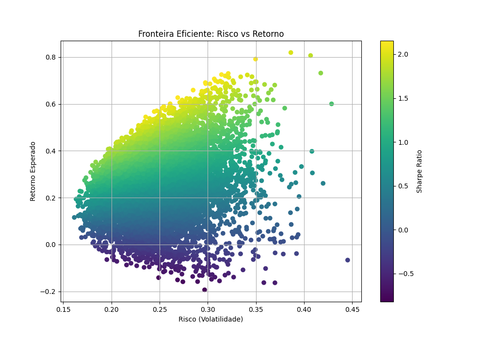
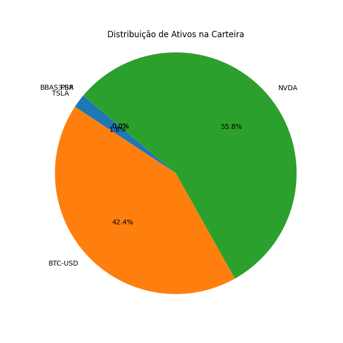
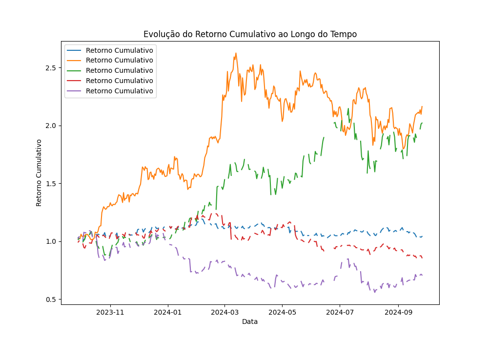
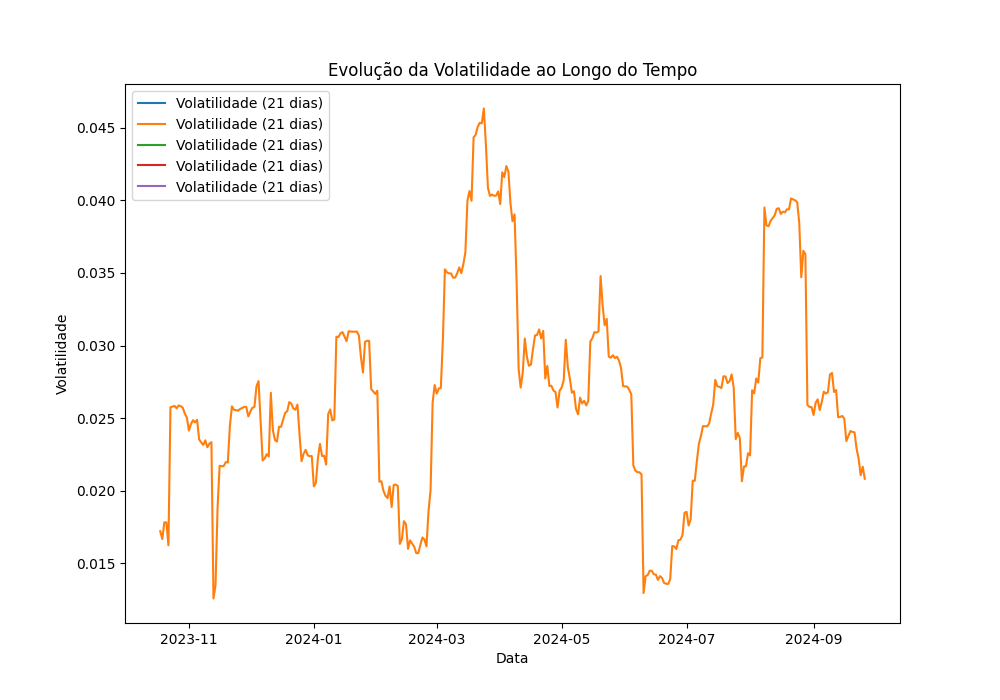

# Investment Portfolio Optimization

## Objetivo

Este projeto implementa um algoritmo de otimização baseado no problema da mochila para construir uma carteira de investimentos. O objetivo é maximizar o retorno esperado de uma carteira de ativos financeiros, respeitando um limite de risco máximo tolerado (capacidade da mochila).

## Justificativa

A otimização da carteira é essencial para investidores que buscam maximizar seus retornos enquanto controlam os riscos associados a seus investimentos. Ao usar o problema da mochila como modelo, tratamos os ativos financeiros como itens que possuem um retorno esperado e um nível de risco (volatilidade). A "capacidade da mochila" representa o limite de risco que o investidor está disposto a aceitar. A abordagem permite que o investidor identifique a melhor combinação de ativos que oferece o maior retorno possível dentro desse limite de risco.

## Abordagem Utilizada

A otimização foi realizada com base no problema da mochila, onde:
- **Itens:** ativos financeiros representados por seu retorno esperado e risco (volatilidade).
- **Capacidade da mochila:** o limite de risco máximo aceitável.
- **Objetivo:** maximizar o retorno esperado da carteira respeitando a capacidade de risco.

### Etapas:
1. **Coleta de dados:** Utilizamos a API do Yahoo Finanças, empregando a biblioteca `yfinance`, para obter os dados históricos dos ativos financeiros selecionados.
2. **Modelagem matemática:** A modelagem envolve a definição das funções que calculam o retorno esperado e o risco da carteira, bem como a configuração do problema de otimização.
3. **Implementação:** O algoritmo de otimização foi implementado utilizando as bibliotecas `numpy` e `scipy.optimize`, permitindo a busca pela melhor combinação de ativos.
4. **Visualização dos resultados:** Os resultados foram visualizados usando `matplotlib` e `seaborn`, proporcionando uma compreensão clara da eficiência da carteira otimizada.

## Resultados

### Fronteira Eficiente


### Distribuição de Ativos na Carteira


### Evolução do Retorno Cumulativo


### Evolução da Volatilidade



## Instruções de Instalação e Execução

### Requisitos
- Python 3.x
- Dependências listadas em `requirements.txt`

### Instalação
1. Clone o repositório:
   ```bash
   git clone https://github.com/israelfds/investment-portfolio-optimization.git
   cd investment-portfolio-optimization
